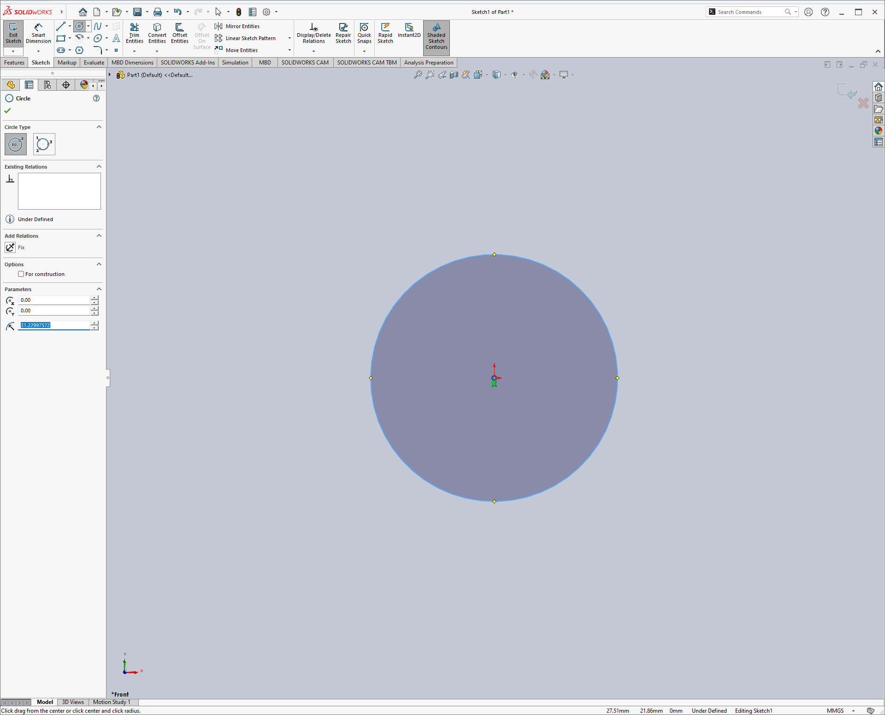
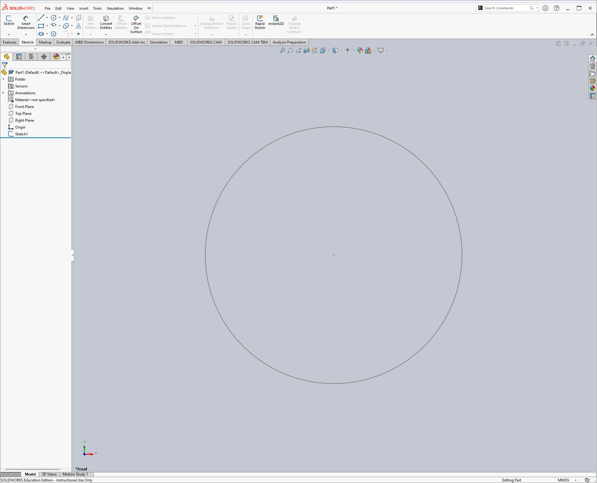
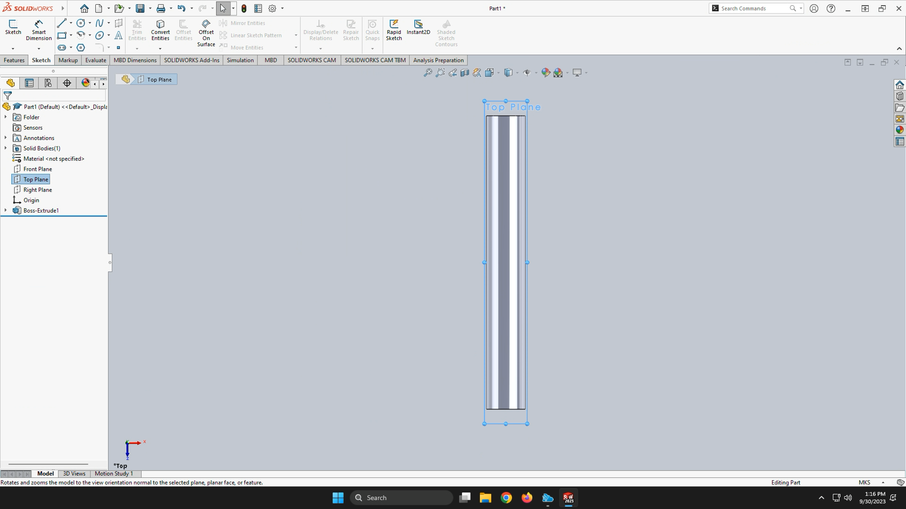
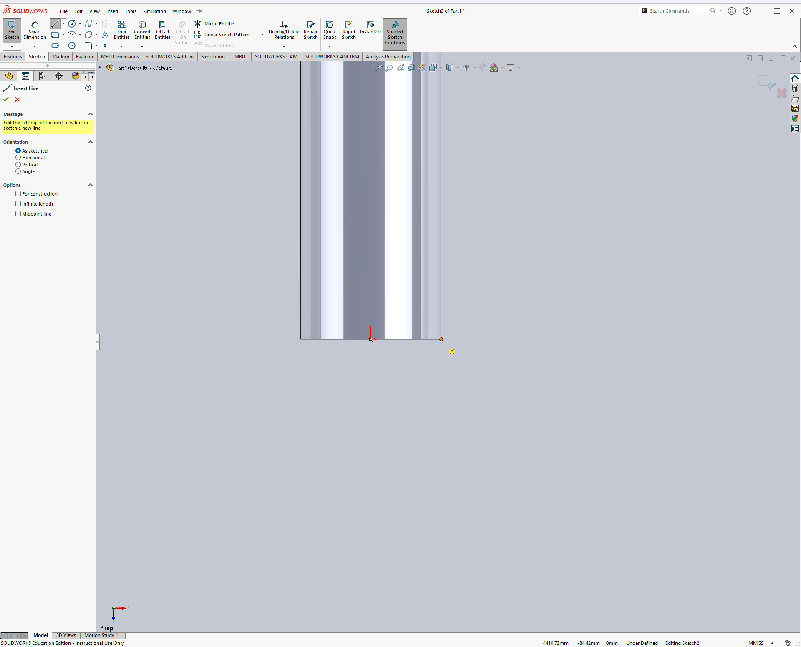
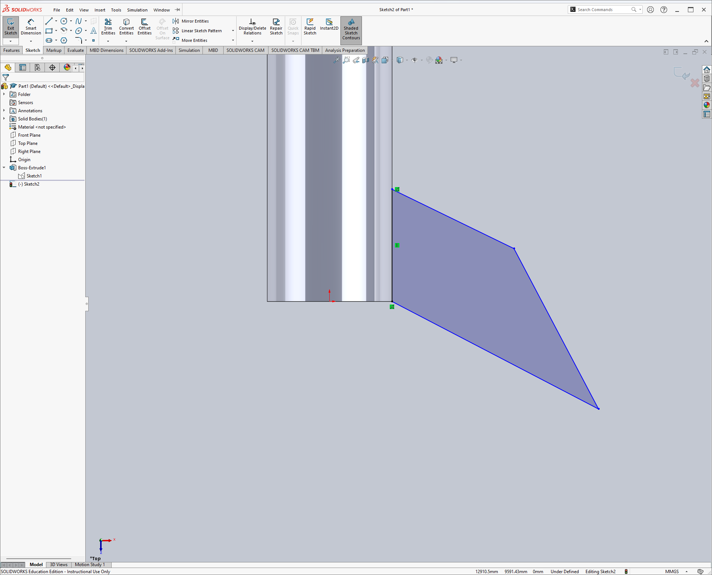
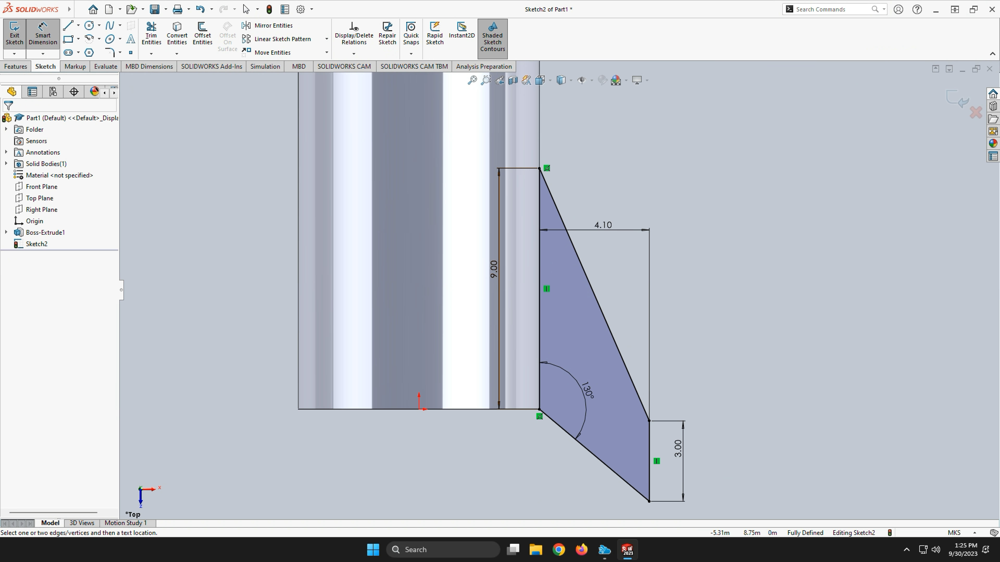
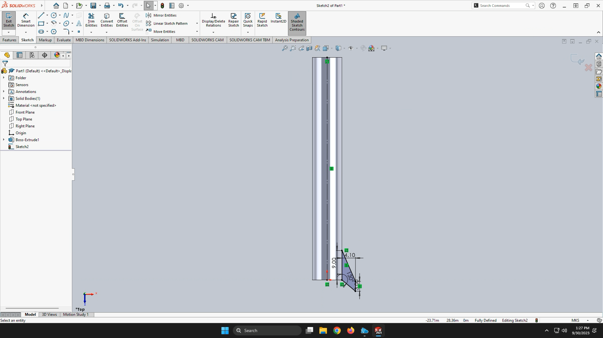
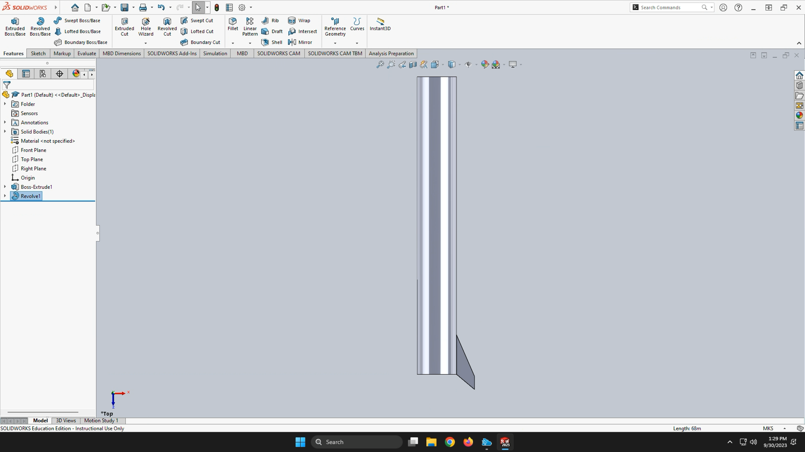
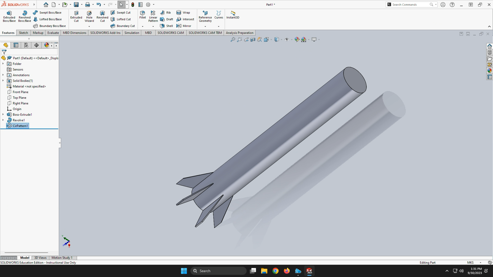

# Lab 6: SolidWorks Modeling

## Contents

- [Lab 6: SolidWorks Modeling](#lab-6-solidworks-modeling)
  - [Contents](#contents)
  - [Resources](#resources)
  - [Introduction](#introduction)
    - [Computing Requirements](#computing-requirements)
  - [Procedure](#procedure)
    - [1. Setup](#1-setup)
    - [2. Solid Starship Superheavy Booster](#2-solid-starship-superheavy-booster)
    - [3. Landing Legs](#3-landing-legs)
  - [Build Your Own Booster](#build-your-own-booster)
  - [Submission](#submission)

## Resources

- [ ] A CAEN computer or personal computer running CAEN SolidWorks (VMWare).

## Introduction

SolidWorks is a solid model computer-aided design (CAD) program. There are many CAD programs, but common features are shared, and some form of CAD is used widely throughout the engineering industry. This lab will walk you through modeling a SpaceX Starship booster, and your own custom small-scale model rocket.

### Computing Requirements

This lab is best done on a CAEN computer, but may also be completed using a personal computer. If you are using a personal computer, you will need to use VMWare in order to access UofM's SolidWorks license. Refer to the [UMich VMWare Setup Article](https://teamdynamix.umich.edu/TDClient/76/Portal/KB/ArticleDet?ID=5309) for help setting this up.

## Procedure

### 1. Setup

Use the following steps to run SolidWorks once you have entered a CAEN workspace (either on a CAEN computer or using VMWare).

1. Search for SolidWorks in the CAEN software directory.

2. Launch SolidWorks 2023 SP3.0 (Student Instructional License).

3. SolidWorks will begin virtualizing. When available, click on SolidWorks and press launch in the small "Cloudpaging Player" window.

### 2. Solid Starship Superheavy Booster

1. You should start with a screen like this:

- Select the *Part* option under the *New* category.

2. Change units to *MKS* (metric). You can leave the dimension standard as *ISO*.
- If a window doesn't appear automatically asking for your unit preference, you can click on the settings "gear", search for units, and change document unit settings to MKS.

3. To get to a 3D model, we have to start in 2D. In the *Command Manager*, switch to the *Sketch* tab.

4. Click *Sketch* in the top left corner.

5. This gives you several plane options. For this exercise it doesn't really matter which one you choose, since we're assembling parts relative to one another. In bigger assemblies with many parts it is crucial you are mindful of the coordinate system. For consistency within this tutorial, choose the **Front Plane**.

6. Once you select the plane, note that SolidWorks rotates to a view so that you're parallel to the plane. This means the plane is essentially a wall in front of you. Notice the markings for the origin as well.

7. Now we begin a drawing on the front plane. Choose the circle option in the top bar.

8. We're going to make the origin as the bottom center of the booster. With *Circle* selected, click on the origin and drag your mouse.

- Don't worry about the dimensions just yet, we'll adjust that later. Just click somewhere so that the circle is finalized.

9. Click *esc* on your keyboard to exit the circle drawing tool.

10. Now we have a circle with random dimensions. You can adjust the dimensions by clicking on the edge of the circle and dragging, changing its size but maintaining its origin.

11. We can fix the size by selecting *Smart Dimension* and then clicking on the edge of the circle.

12. Once again, the value doesn't matter yet, so click anywhere to solidify the dimensions.

13. You'll see a dimension box pop up - this is where we'll define the dimensions. The &oslash; symbol indicates the dimension is a diameter. The diameter of the Starship booster is 9 meters, so let's set this to 9, ensure it's in meters, and click *enter*.

14. Click *esc* to exit the dimensioning tool. Note that you are now unable to adjust the diameter by clicking and dragging as you have locked in the dimensions.

15. We now have a 2D sketch, but we still need to turn it into a 3D booster cylinder. Click *Exit Sketch* in the top left corner.

16. Your screen should now look like this:

- In the *Feature Tree*, note that *Sketch1* has been added. If you wanted to adjust something in that sketch, you can go back into editing it from the *Feature Tree*.

17. Navigate to the *Features* tab in the *Command Manager* to make our 2D sketch 3D.

18. Click *Extrude Boss/Base*.

19. SolidWorks should automatically select the one sketch you have, but if not, click on the circle you have drawn.

20. Change the length of the extrusion to 68 meters, the height of the Starship booster, and click enter.

If you chose MKS as the document units, the program should assume meters for any dimension entries. If this isn't the case, it may default to millimeters or some other unit. Make sure to watch out for this so you're not building an "ant-size" rocket.

21. SolidWorks is making an assumption about the direction of the extrusion. Let's try reversing this, by clicking on the little box containing two arrows next to *Blind*, and notice the direction change.

22. Click the green checkmark to finish the extrusion.

23. We now have a solid rocket booster body! Note that this extrusion was also added to the feature tree and, because it was based on our sketch, *Sketch1* is now a component of this feature in the tree. If you wanted to edit the sketch or extrusion, you'd still be able to access both within the tree.

24. This is a great time to save your booster, if you haven't already.

- Click *ctrl + s* on your keyboard, or *File > Save* on the SolidWorks window.

- Name the file something you'll recognize later.

- Save it in *Documents* so that you'll be able to access it on the CAEN computers in the future.

### 3. Landing Legs

1. Let's start working on the landing legs. Click *Sketch*, navigate to the *Feature Tree* tab, and select the top plane that cuts through the booster.

2. Even though we see a 3D part in front of us, the fact that we're in sketch means that we're drawing on a 2D plane, and our choice of plane intersects the body.

3. Let's start with a line this time. Click *Line*.

4. Click on the bottom right "corner" of the booster. Since we've established that the plane intersects the booster, this generated orange point is telling us that this is where the point is constrained to the bottom, side, and middle plane of the booster.

5. Drag your line out some distance. Again, we'll solidify this dimension later.

6. Draw one more line that is constrained to the edge of the booster, up some distance from the bottom, dragging outward.

7. Draw two more lines connecting all of these points into a four sided shape.

8. Click *esc* to exit the line drawing tool.

9. In this configuration, you should be able to drag the top of the two points on the edge of the booster, and it will stay in line on the booster. It's therefore constrained to that line.

10. Let's add another constraint:

- Click the right line.

- Click *Vertical*.

- Click the checkmark.

11. Now let's add some dimensions. We can start with the sloping angle. Dimensioning angles works by, instead of selecting only one line or edge, selecting two that are angled with respect to each other. SolidWorks will determine that we want the angle between them.

- Select *Smart Dimension*.

- Select the left vertical line that is attached to the booster edge.

- Select the bottom line.

- Click anywhere.

- Change the value to 130 degrees.

12. Next, dimension the left line as 9 meters, and the right line as 3 meters.

13. Since not all of the lines are black, we can tell that the sketch is not fully constrained. Leave dimensioning mode and click on an edge of the sketch to see what degrees of freedom are remaining.

14. Dimension the distance across by selecting the bottom line, and moving your mouse until the dimension is expressed as the distance across rather than the length of the line. Click where that happens, and set the width to 4.1 meters.

15. Once you click away from the last dimension and click *esc*, your sketch should look like this:

This sketch is therefore fully constrained, and if you were to give it a tug on any point, it shouldn't move!

16. We're going to add one more thing to this sketch. Draw a vertical line from the origin to the top of the booster. SolidWorks should provide orange points on both sides, constraining it to the top and bottom of the booster. It should also align with the dashed vertical line SolidWorks will display.

17. Click *esc* to exit the line drawing tool.

18. Right-click on the new line and select *Construction Geometry*. It's the box with two arrows pointing in either direction (hover over it to confirm).

19. Exit the sketch.

20. Navigate to the *Features* tab.

21. Click *Revolved Boss/Base*. You may need to select the vertical line we made earlier.

22. SolidWorks will likely default to revolving all of the way around the booster. Change 360 degrees to 2.5 and click the checkmark.

23. Note that, realistically, we probably don't want landing legs that are narrower at their base than at the ends, but this is just a learning exercise in revolving and patterning components.

24. In the *Features* tab, expand the dropdown menu under *Linear Pattern* and select *Circular Pattern*.

25. Highlight the field under *Direction 1* and select the base of the booster.

To change your view, you can push down on the scroll wheel of the mouse and drag the mouse around to find a view that fits your needs.

26. Highlight the field under *Features and Faces* and select the one landing leg.

27. Change the angle to 60 degrees and set the number of components to 6.

28. Click the checkmark.

30. You now have a rough model of a Starship Superheavy Booster!

31. Let's clean it up a bit. Under the *Features* tab, go to *Fillet*.

32. Select the 12 outside corners of the landing legs.

33. Change the fillet radius to 0.25 meters, and click the checkmark.

## Build Your Own Booster

Use the skills you learned in this lab to create a model rocket's booster with a realistic scale.
- Do some research on model rockets to get an idea on standard sizing.
- Your design should consist of, at the minimum, these following components:
  - Body tube
  - A number of properly spaced fins (at least three)
  - If you'd like an additional challenge, you can experiment with making a nose cone and/or making the fins so they are not narrower at their base. Note that both of these things are ***optional***.

## Submission

On Canvas, you will submit ***ONE PDF*** that will include all of the following:

- [ ] A screenshot of your finished "tutorial" model with matching dimensions.
- [ ] A screenshot of your custom model rocket CAD design with the mentioned requirements.
- [ ] A list of dimensions for your custom design, such as body tube length and diameter, and fin sizes.

To put said content into a PDF, it is suggested you create a new Google Doc ([docs.new](https://docs.new)) and paste your images and write any text in the document. Export/Download this document as a PDF and upload it. **DO NOT SUBMIT A GOOGLE DOC FILE OR SPREADSHEET FILES.**

Submitting anything other than a single PDF may result in your work not being graded or your scores being heavily delayed.

