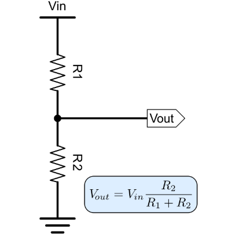
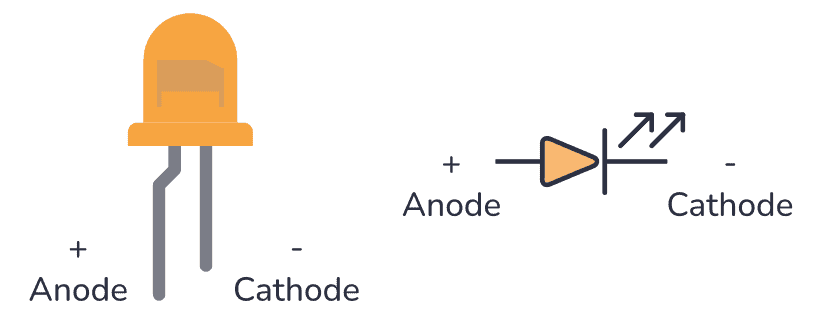

# Resources

A collection of useful cheat-sheets and diagrams you may find yourself referring back to over the course of the semester.

## Contents

- [Resources](#resources)
  - [Contents](#contents)
  - [Arduino Nano Pinout](#arduino-nano-pinout)
  - [Arduino Nano Tech-Specs](#arduino-nano-tech-specs)
  - [Voltage Divider](#voltage-divider)
  - [LED Anode vs Cathode](#led-anode-vs-cathode)
  - [Basic Circuitry Formulas](#basic-circuitry-formulas)
  - [Resistor Color Codes](#resistor-color-codes)
  - [TMP36 Wiring](#tmp36-wiring)

## Arduino Nano Pinout

## Arduino Nano Tech-Specs

- Built-in LED Pin #: 13
- Digital Pins: 14
- Analog Pins: 8
- PWM Pins: 6
- Voltage: 5V
- Input-Voltage: 7-12V
- Current per Pin: 20mA

For more detailed specs, see [the Arduino Nano website](https://docs.arduino.cc/hardware/nano)

*[PWM]: Pulse Width Modulation

## Voltage Divider

## LED Anode vs Cathode

## Basic Circuitry Formulas

Voltage (V in Volts) = Current (I in Amps) * Resistance (R in Ohms)

Power (Watts) = Voltage (Volts) * Current (Amps)

Similarly, Watt-hours = Volts * Amp-hours

## Resistor Color Codes

## TMP36 Wiring

